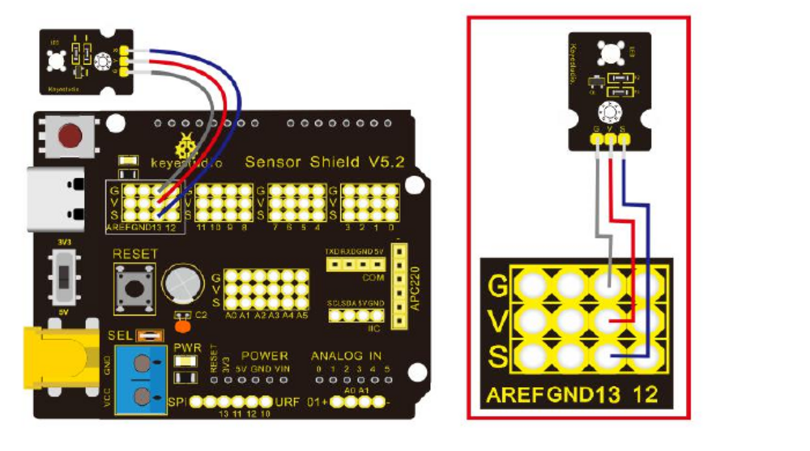
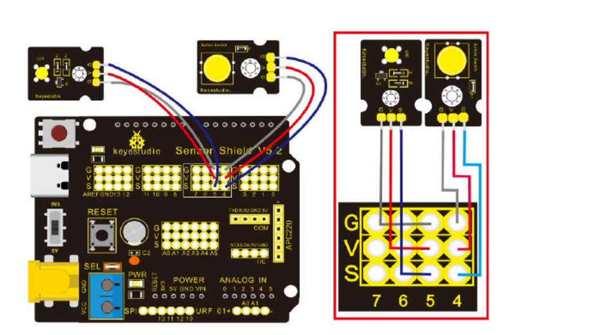
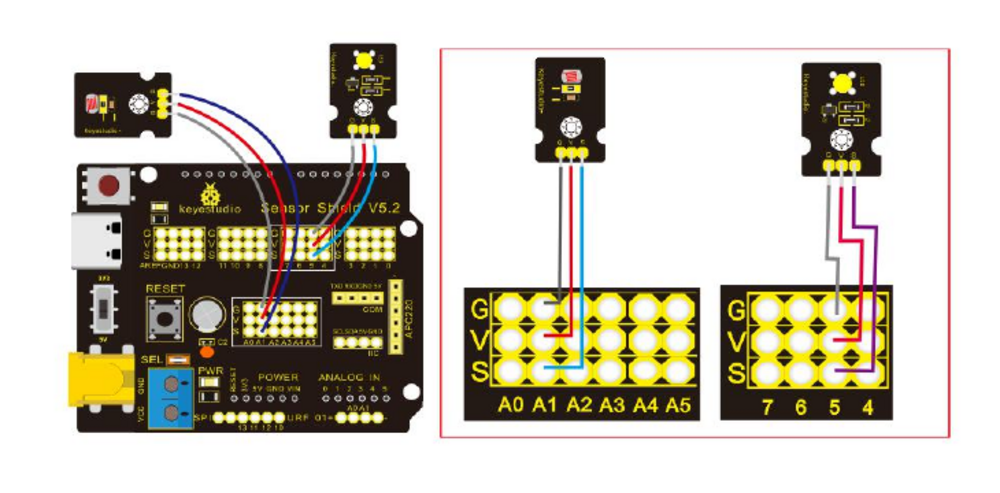

# Arduino Adventures

Welcome! In these lessons, you will teach a small computer called an Arduino to control lights, listen to sensors, and make things happen.

The activities use the Keyestudio Smart Home Kit. The original instructions are in the [KS0085 kit guide](../../KS0085.pdf). The lessons are in a new order so each one builds on things you have already tried.

## How to Use Each Lesson

1. Read the short idea first.
2. Open the linked exercise in the kit guide and look at its wiring picture.
3. Build the circuit with the USB cable unplugged. Ask your teacher to check it before connecting power.
4. Try the starter sketch in `Exercises`. Fill in its TODOs and predict what it will do.
5. If you get stuck, compare your work with the matching sketch in `Solutions`.

Some kit activities do not have a starter sketch in this folder yet. For those, follow the instructions and code in the linked kit-guide exercise.

## First, How Arduino Code Works

Arduino code is a list of instructions. The Arduino follows them from top to bottom. Some instructions are **functions**: named jobs that do something. The words inside parentheses tell the function what to work on.

Every sketch has two special functions:

- `setup()` runs once when the Arduino starts. Put one-time jobs here, like preparing pins.
- `loop()` runs again and again for as long as the Arduino has power. Put the repeating activity here.

Here is a tiny blink program. Read it line by line and match each instruction to what the LED does:

```cpp
const int LED_PIN = 13;

void setup() {
	pinMode(LED_PIN, OUTPUT);
}

void loop() {
	digitalWrite(LED_PIN, HIGH);
	delay(500);
	digitalWrite(LED_PIN, LOW);
	delay(500);
}
```

`LED_PIN` is a **variable**: a named place to keep a value. `const` means this value should stay the same. Giving pin 13 the name `LED_PIN` makes the sketch easier to read and change.

## Inputs and Outputs

Think of the Arduino like a tiny helper. It **reads inputs** to find out what is happening, then **controls outputs** to do something about it.

- An **input** sends information to the Arduino. A button is usually on or off. A photocell sends a changing reading depending on the light.
- An **output** is controlled by the Arduino. An LED can turn on or off; a buzzer can make a sound.
- A **pin** is a connection the Arduino uses to talk to a part. Always use the pin number shown in the wiring diagram and sketch.

For a button wired with a pull-down resistor, a released button reads `LOW` and a pressed button reads `HIGH`. Other circuits can work the opposite way, so check the wiring and lesson instructions.

On this UNO-compatible board, `analogRead()` gives a number from 0 to 1023. A higher number means a higher measured voltage at that input; for a photocell, the exact reading depends on its wiring and the light.

## Code Toolbox

Meet these tools as you reach the matching lessons. A function call has a name followed by parentheses. Its **arguments** (the values inside) tell it which pin or value to use.

### Prepare a Pin

`pinMode(pin, mode)` tells a pin what job to do. Use `INPUT` when a button or sensor sends information in. Use `OUTPUT` when the Arduino controls an LED or another part.

```cpp
pinMode(13, INPUT);
pinMode(12, OUTPUT);
```

### Read and Control Digital Signals

- `digitalRead(pin)` checks an input pin. It gives back `HIGH` or `LOW`.
- `digitalWrite(pin, state)` sets an output pin to `HIGH` (on) or `LOW` (off).
- `HIGH` and `LOW` are named values for the two digital states. They are easier to understand than writing `1` and `0`.

```cpp
int buttonState = digitalRead(13);
digitalWrite(12, HIGH);
```

`int` makes a variable for a whole number. In the first line, the number returned by `digitalRead()` is saved so the program can use it later.

### Read a Changing Sensor

`analogRead(pin)` measures a changing input and gives back a number. For example:

```cpp
int lightReading = analogRead(A1);
```

`A1` means analog input 1. The Arduino stores the result in `lightReading`. Cover the photocell and watch how the number changes in the Serial Monitor.

### Make Decisions

`if` is a C++ language instruction, not a function. It checks a question and runs the code inside `{ }` only when the answer is true.

```cpp
if (lightReading < 500) {
	digitalWrite(12, HIGH);
} else {
	digitalWrite(12, LOW);
}
```

Here `<` means “is less than.” `else` means “otherwise.” Other useful comparison signs are `>` (greater than) and `==` (is equal to). Use `==` to compare two things; one `=` saves a value in a variable.

### Wait and Look at Readings

- `delay(milliseconds)` pauses the sketch. `delay(500)` waits for half a second because 1,000 milliseconds make one second.
- `Serial.begin(9600)` starts the link to the computer. Put it in `setup()`.
- `Serial.print(value)` shows a value without moving to a new line.
- `Serial.println(value)` shows a value and then starts a new line. Open the IDE's Serial Monitor to see it.

```cpp
Serial.begin(9600);
Serial.println(lightReading);
```

### Make a Buzzer Play

- `tone(pin, frequency)` tells a passive buzzer to play a pitch. Frequency is measured in hertz (`Hz`); a bigger number makes a higher pitch.
- `noTone(pin)` stops the sound on that pin.

```cpp
tone(12, 440);  // Play a note at 440 Hz
delay(500);
noTone(12);
```

This makes a sound; it is **not** the PWM brightness lesson.

### Repeat Instructions

`for` is another C++ language instruction, not a function. It repeats instructions and counts each time. This example counts from 0 to 4:

```cpp
for (int count = 0; count < 5; count++) {
	Serial.println(count);
}
```

The three parts mean: start `count` at 0; keep going while it is less than 5; add 1 after each turn. An **array** is a numbered list of values, useful for storing a row of musical notes. A loop can visit each value in the list.

### Measure Time for a Reaction Game

`millis()` gives the number of milliseconds since the Arduino started. It is useful for measuring elapsed time without rounding to whole seconds.

```cpp
unsigned long startTime = millis();
// Wait for the player to press the button...
unsigned long elapsedTime = millis() - startTime;
```

`unsigned long` is a whole-number type that can hold the large time values returned by `millis()`. `random(minimum, maximum)` chooses a changing number for a wait; the maximum is not included. `randomSeed(value)` helps the sequence change after restarting.

### Change LED Brightness with PWM

`analogWrite(pin, amount)` uses **PWM** on a supported pin. The amount goes from `0` (off) to `255` (brightest). PWM turns the pin on and off very quickly; changing the on-time changes how bright the LED looks. It does not make a smooth analog voltage, and it only works for PWM-capable pins.

```cpp
analogWrite(9, 80);   // A dimmer brightness
analogWrite(9, 255);  // Brightest setting
```

You will meet this in Lesson 9, not Lesson 3. For servos, displays, relays, and Bluetooth, the kit guide shows the extra library functions or wiring those parts need.

## Part 1: Lights, Buttons, and Sound

### Lesson 1: Blink an LED

An LED is an output: the Arduino can set its pin to `HIGH` to turn it on or `LOW` to turn it off. A delay gives your eyes time to see each change. This is your first look at `setup()` and `loop()`.



[Open the original LED Blink exercise, Project 1, page 33](../../KS0085.pdf#page=33).

### Lesson 2: Read a Button

A button is an input. Pressing it changes the signal the Arduino reads. Try printing the reading so you can watch it change in the Serial Monitor.



[Open the original Button Sensor exercise, Project 4, page 61](../../KS0085.pdf#page=61). [Open the button-reading starter](Exercises/button_read/button_read.ino) or [its solution](Solutions/button_read/button_read.ino).

### Lesson 3: Make a Buzzer Sound

A passive buzzer makes a sound when the Arduino sends it a repeated signal. `tone(pin, frequency)` chooses the pitch: a bigger frequency number means a higher note. This is sound, not PWM; PWM is saved for Lesson 9.


[Open the original Passive Buzzer exercise, Project 3, page 48](../../KS0085.pdf#page=48).

### Lesson 4: Make a Button Control an LED

Now use an input and an output together. An `if` statement lets the program choose what to do when the button is pressed. A variable can remember whether the LED should be on or off.

[Use the Button Sensor wiring in Project 4, page 61](../../KS0085.pdf#page=61). [Open the button LED exercise](Exercises/button_led_toggle/button_led_toggle.ino) or [its solution](Solutions/button_led_toggle/button_led_toggle.ino).

### Lesson 5: Play a Note Sequence

A list can store several note pitches. A `for` loop can play each note in turn, so you do not need to write the same instruction again and again.

[Use the Passive Buzzer exercise, Project 3, page 48](../../KS0085.pdf#page=48). [Open the note-sequence starter](Exercises/buzzer_examples/note_sequence/note_sequence.ino) or [its solution](Solutions/buzzer_examples/note_sequence/note_sequence.ino).

## Part 2: Let the Arduino Notice Light

### Lesson 6: Read a Photocell

A photocell changes its electrical signal when the light around it changes. The Arduino turns that signal into a number. Cover the sensor, shine a light on it, and compare the readings.



[Open the original Photocell Sensor exercise, Project 6, page 70](../../KS0085.pdf#page=70). Read how it works on [page 71](../../KS0085.pdf#page=71); its wiring picture is on [page 72](../../KS0085.pdf#page=72).

### Lesson 7: Let Light Control an LED

Choose a threshold number. If the photocell reading is below or above that number, use an `if` statement to change the LED. This is a simple example of a sensor making a decision.

[Use the Photocell Sensor exercise, Project 6, page 70](../../KS0085.pdf#page=70). [Open the light-controlled LED starter](Exercises/light_sensor_led_control/light_sensor_led_control.ino) or [its solution](Solutions/light_sensor_led_control/light_sensor_led_control.ino).

### Lesson 8: Let Light Change a Buzzer Pitch

Use the photocell reading to choose the buzzer pitch. Now one sensor reading controls a different kind of output: sound instead of light.

[Review Photocell Sensor, Project 6, page 70](../../KS0085.pdf#page=70), and [Passive Buzzer, Project 3, page 48](../../KS0085.pdf#page=48). [Open the light-to-sound starter](Exercises/light_sensor_buzzer/light_sensor_buzzer.ino) or [its solution](Solutions/light_sensor_buzzer/light_sensor_buzzer.ino).

## Part 3: Brightness and Moving Parts

### Lesson 9: Fade an LED with PWM

This is the first PWM lesson. The Arduino turns the LED on and off very quickly. Changing how long it stays on makes it look brighter or dimmer. On this board, `analogWrite()` uses values from 0 (off) to 255 (brightest).

[Open the original Breathing Light exercise, Project 2, page 40](../../KS0085.pdf#page=40). [Open the RGB fading starter](Exercises/rgb_lamp_fade/rgb_lamp_fade.ino) or [its solution](Solutions/rgb_lamp_fade/rgb_lamp_fade.ino).

### Lesson 10: Switch a Low-Voltage Device with a Relay

A relay is an electrically controlled switch. First learn how its control signal works with the kit's safe, low-voltage example. **Never connect a relay to a wall outlet or household mains electricity.**

[Open the original 1-channel Relay Module exercise, Project 5, page 65](../../KS0085.pdf#page=65). Do this lesson with your teacher.

### Lesson 11: Control the Fan Module

A motor changes electrical energy into movement. Start by turning the kit's fan on and off, and notice that motors need more care than LEDs.

[Open the original Fan Module exercise, Project 8, page 81](../../KS0085.pdf#page=81).

### Lesson 12: Move a Servo

A servo moves to a chosen position instead of spinning freely. Try asking it to point to different angles, such as left, middle, and right.

[Open the original Adjusting Motor Servo Angle exercise, Project 7, page 75](../../KS0085.pdf#page=75).

## Part 4: Build a Smart Home

### Lesson 13: Read the Steam Sensor

Sensors turn something in the real world into an electrical signal. See how the steam sensor reading changes when its surroundings change. Keep water away from the Arduino board and wires.

[Open the original Steam Sensor exercise, Project 9, page 85](../../KS0085.pdf#page=85).

### Lesson 14: Detect Movement with PIR

A PIR sensor notices changes in infrared energy, such as a person moving nearby. Its output acts like a button: the Arduino can read whether movement was detected.

[Open the original PIR Motion Sensor exercise, Project 10, page 90](../../KS0085.pdf#page=90).

### Lesson 15: Measure Soil Humidity

The soil sensor gives a changing reading that you can compare with a threshold. Test dry and damp soil, then think about how a plant-watering reminder could work.

[Open the original Soil Humidity Sensor exercise, Project 13, page 107](../../KS0085.pdf#page=107).

### Lesson 16: Explore the MQ-2 Gas Sensor

This sensor responds to some gases. Look at how its reading changes in the kit activity. It is a classroom experiment, **not** a safety alarm; do not test it with flames, lighters, or household gas.

[Open the original Analog Gas (MQ-2) Sensor exercise, Project 11, page 96](../../KS0085.pdf#page=96). Do this lesson with your teacher.

### Lesson 17: Show Information on the LCD

An LCD is a tiny screen. Use it to show words or sensor numbers, so people can understand what your Arduino has noticed.

[Open the original 1602 LCD Display exercise, Project 12, page 102](../../KS0085.pdf#page=102).

### Lesson 18: Send Data with Bluetooth

Bluetooth lets two nearby devices send information without a wire. Start with the kit's connection test before trying to control anything from an app.

[Open the original Bluetooth Test exercise, Project 14, page 114](../../KS0085.pdf#page=114).

### Lesson 19: Build the Multipurpose Smart Home

You have learned about inputs, decisions, and outputs. Combine a few sensors and devices into one project, and explain what each part does.

[Open the original Multi-purpose Smart Home project, Project 15, page 159](../../KS0085.pdf#page=159).

## Project Folders

- `Exercises` has starter sketches with TODO comments.
- `Solutions` has completed sketches. Try the exercise before opening its solution.
- Open an `.ino` sketch from its matching folder in the Arduino IDE.

The first four wiring diagrams are adapted from the Keyestudio KS0085 kit guide.
