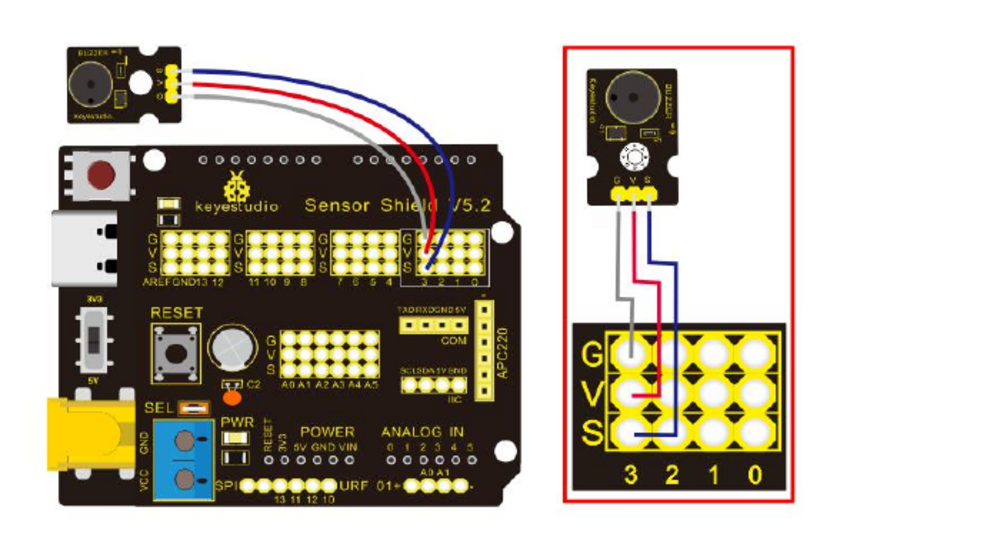

# Lesson Material

This guide sequences the Smart Home Kit activities and links to the corresponding starter sketches, solutions, wiring diagrams, and kit-guide pages. Start with the [general Arduino guide](../README.md) if you want a refresher on the programming concepts. Each lesson has five progressively harder optional tasks and full code in the [ChallengesAndSolutions guide](../ChallengesAndSolutions/README.md).

## How to Use Each Lesson

1. Read the short idea first.
2. Open the linked exercise in the kit guide and look at its wiring picture.
3. Build the circuit with the USB cable unplugged, then check the wiring before connecting power.
4. Try the matching starter sketch in [ExercisesAndSolutions/Exercises](../ChallengesAndSolutions/ExercisesAndSolutions/Exercises/). Fill in its TODOs and predict what it will do.
5. If you get stuck, compare your work with the matching sketch in [ExercisesAndSolutions/Solutions](../ChallengesAndSolutions/ExercisesAndSolutions/Solutions/).

Some kit activities do not have a starter sketch in `ExercisesAndSolutions/Exercises` yet. For those, follow the instructions and code in the linked kit-guide exercise.

## Part 1: Start with Outputs and Inputs

### Lesson 1: Blink an LED

[Open the complete lesson solution](Solutions/Lesson01_BlinkAnLED/Lesson01_BlinkAnLED.ino).

An LED is an output: the Arduino can set its pin to `HIGH` to turn it on or `LOW` to turn it off. A delay gives your eyes time to see each change. This is your first look at `setup()` and `loop()`.

[Open the original LED Blink exercise, Project 1, page 33](../../KS0085.pdf#page=33).

**Fun mission:** Make the LED blink twice quickly, then wait two seconds.

### Lesson 2: Read a Button

[Open the complete lesson solution](Solutions/Lesson02_ReadAButton/Lesson02_ReadAButton.ino).

A button is an input. Pressing it changes the signal the Arduino reads. Try printing the reading so you can watch it change in the Serial Monitor.

[Open the original Button Sensor exercise, Project 4, page 61](../../KS0085.pdf#page=61). [Open the button-reading starter](../ChallengesAndSolutions/ExercisesAndSolutions/Exercises/button_read/button_read.ino) or [its solution](../ChallengesAndSolutions/ExercisesAndSolutions/Solutions/button_read/button_read.ino).

**Fun mission:** Guess whether the button will read `HIGH` or `LOW` before pressing it, then check your guess in the Serial Monitor.

### Lesson 3: Make a Button Control an LED

[Open the complete lesson solution](Solutions/Lesson03_ButtonControlsLED/Lesson03_ButtonControlsLED.ino).

Now use an input and an output together. An `if` statement lets the program choose what to do when the button is pressed. A variable can remember whether the LED should be on or off.

[Use the Button Sensor wiring in Project 4, page 61](../../KS0085.pdf#page=61). [Open the button LED exercise](../ChallengesAndSolutions/ExercisesAndSolutions/Exercises/button_led_toggle/button_led_toggle.ino) or [its solution](../ChallengesAndSolutions/ExercisesAndSolutions/Solutions/button_led_toggle/button_led_toggle.ino).

**Fun mission:** Make the LED turn on while you hold the button and turn off when you release it.

## Part 2: Read Light and Respond to It

### Lesson 4: Read a Photocell

[Open the complete lesson solution](Solutions/Lesson04_ReadPhotocell/Lesson04_ReadPhotocell.ino).

A photocell changes its electrical signal when the light around it changes. The Arduino turns that signal into a number. Cover the sensor, shine a light on it, and compare the readings.

[Open the original Photocell Sensor exercise, Project 6, page 70](../../KS0085.pdf#page=70). Read how it works on [page 71](../../KS0085.pdf#page=71); its wiring picture is on [page 72](../../KS0085.pdf#page=72).

**Fun mission:** Cover and uncover the photocell. Find out which action makes its reading larger.

### Lesson 5: Let Light Control an LED

[Open the complete lesson solution](Solutions/Lesson05_LightControlsLED/Lesson05_LightControlsLED.ino).

Choose a threshold number. If the photocell reading is below or above that number, use an `if` statement to change the LED. This is a simple example of a sensor making a decision.

[Use the Photocell Sensor exercise, Project 6, page 70](../../KS0085.pdf#page=70). [Open the light-controlled LED starter](../ChallengesAndSolutions/ExercisesAndSolutions/Exercises/light_sensor_led_control/light_sensor_led_control.ino) or [its solution](../ChallengesAndSolutions/ExercisesAndSolutions/Solutions/light_sensor_led_control/light_sensor_led_control.ino).

**Fun mission:** Make a simple night-light: the LED turns on when you shade the photocell.

## Part 3: Make and Control Sound

### Lesson 6: Make a Buzzer Sound

[Open the complete lesson solution](Solutions/Lesson06_MakeBuzzerSound/Lesson06_MakeBuzzerSound.ino).

A passive buzzer makes a sound when the Arduino sends it a repeated signal. `tone(pin, frequency)` chooses the pitch: a bigger frequency number means a higher note. This is sound, not PWM; PWM is saved for Lesson 9.

[Open the original Passive Buzzer exercise, Project 3, page 48](../../KS0085.pdf#page=48).

**Fun mission:** Play your chosen note for one second, then leave one second of silence.

### Lesson 7: Play a Note Sequence

[Open the complete lesson solution](Solutions/Lesson07_PlayNoteSequence/Lesson07_PlayNoteSequence.ino).

A list can store several note pitches. A `for` loop can play each note in turn, so you do not need to write the same instruction again and again.

[Use the Passive Buzzer exercise, Project 3, page 48](../../KS0085.pdf#page=48). [Open the note-sequence starter](../ChallengesAndSolutions/ExercisesAndSolutions/Exercises/buzzer_examples/note_sequence/note_sequence.ino) or [its solution](../ChallengesAndSolutions/ExercisesAndSolutions/Solutions/buzzer_examples/note_sequence/note_sequence.ino).

**Fun mission:** Change one note in the tune and ask a friend to guess which one changed.

### Lesson 8: Let Light Change a Buzzer Pitch

[Open the complete lesson solution](Solutions/Lesson08_LightChangesBuzzerPitch/Lesson08_LightChangesBuzzerPitch.ino).

Use the photocell reading to choose the buzzer pitch. Now one sensor reading controls a different kind of output: sound instead of light.

[Review Photocell Sensor, Project 6, page 70](../../KS0085.pdf#page=70), and [Passive Buzzer, Project 3, page 48](../../KS0085.pdf#page=48). [Open the light-to-sound starter](../ChallengesAndSolutions/ExercisesAndSolutions/Exercises/light_sensor_buzzer/light_sensor_buzzer.ino) or [its solution](../ChallengesAndSolutions/ExercisesAndSolutions/Solutions/light_sensor_buzzer/light_sensor_buzzer.ino).

**Fun mission:** Shade the photocell slowly and listen as the buzzer pitch changes.

## Part 4: Change Brightness and Detect Movement

### Lesson 9: Fade an LED with PWM

[Open the complete lesson solution](Solutions/Lesson09_FadeLEDWithPWM/Lesson09_FadeLEDWithPWM.ino).

This is the first PWM lesson. The Arduino turns the LED on and off very quickly. Changing how long it stays on makes it look brighter or dimmer. On this board, `analogWrite()` uses values from 0 (off) to 255 (brightest).

[Open the original Breathing Light exercise, Project 2, page 40](../../KS0085.pdf#page=40). [Open the RGB fading starter](../ChallengesAndSolutions/ExercisesAndSolutions/Exercises/rgb_lamp_fade/rgb_lamp_fade.ino) or [its solution](../ChallengesAndSolutions/ExercisesAndSolutions/Solutions/rgb_lamp_fade/rgb_lamp_fade.ino).

**Fun mission:** Make the LED slowly brighten and dim like a breathing light.

### Lesson 10: Detect Movement with PIR

[Open the complete lesson solution](Solutions/Lesson10_DetectMovementWithPIR/Lesson10_DetectMovementWithPIR.ino).

A PIR sensor notices changes in infrared energy, such as a person moving nearby. Its output acts like a button: the Arduino can read whether movement was detected.

[Open the original PIR Motion Sensor exercise, Project 10, page 90](../../KS0085.pdf#page=90).

**Fun mission:** Print `Hello, motion!` once when the PIR sensor first detects movement.

## Part 5: Explore More Sensors

### Lesson 11: Read the Steam Sensor

[Open the complete lesson solution](Solutions/Lesson11_ReadSteamSensor/Lesson11_ReadSteamSensor.ino).

Sensors turn something in the real world into an electrical signal. See how the steam sensor reading changes when its surroundings change. Keep water away from the Arduino board and wires.

[Open the original Steam Sensor exercise, Project 9, page 85](../../KS0085.pdf#page=85).

**Fun mission:** During the kit's approved demonstration, print one reading before and one during the test. Keep moisture away from the electronics.

### Lesson 12: Measure Soil Humidity

[Open the complete lesson solution](Solutions/Lesson12_MeasureSoilHumidity/Lesson12_MeasureSoilHumidity.ino).

The soil sensor gives a changing reading that you can compare with a threshold. Test dry and damp soil, then think about how a plant-watering reminder could work.

[Open the original Soil Humidity Sensor exercise, Project 13, page 107](../../KS0085.pdf#page=107).

**Fun mission:** Print `Check the plant` when the approved soil test is in the dry range.

### Lesson 13: Explore the MQ-2 Gas Sensor

[Open the complete lesson solution](Solutions/Lesson13_ExploreMQ2Sensor/Lesson13_ExploreMQ2Sensor.ino).

This sensor responds to some gases. Look at how its reading changes in the kit activity. It is a classroom experiment, **not** a safety alarm; do not test it with flames, lighters, or household gas.

[Open the original Analog Gas (MQ-2) Sensor exercise, Project 11, page 96](../../KS0085.pdf#page=96).

**Fun mission:** During the kit's approved classroom test, print the reading with `Experiment only - not an alarm`. Never test with flames, lighters, or household gas.

## Part 6: Control Devices

### Lesson 14: Switch a Low-Voltage Device with a Relay

[Open the complete lesson solution](Solutions/Lesson14_LowVoltageRelay/Lesson14_LowVoltageRelay.ino).

A relay is an electrically controlled switch. First learn how its control signal works with the kit's safe, low-voltage example. **Never connect a relay to a wall outlet or household mains electricity.**

[Open the original 1-channel Relay Module exercise, Project 5, page 65](../../KS0085.pdf#page=65).

**Fun mission:** Using the kit's low-voltage circuit, make the button switch the relay on and off. Never connect it to household electricity.

### Lesson 15: Control the Fan Module

[Open the complete lesson solution](Solutions/Lesson15_ControlFan/Lesson15_ControlFan.ino).

A motor changes electrical energy into movement. Start by turning the kit's fan on and off, and notice that motors need more care than LEDs.

[Open the original Fan Module exercise, Project 8, page 81](../../KS0085.pdf#page=81).

**Fun mission:** Make the kit fan run for two seconds, stop for two seconds, and repeat. Keep fingers and loose objects away from moving parts.

### Lesson 16: Move a Servo

[Open the complete lesson solution](Solutions/Lesson16_MoveServo/Lesson16_MoveServo.ino).

A servo moves to a chosen position instead of spinning freely. Try asking it to point to different angles, such as left, middle, and right.

[Open the original Adjusting Motor Servo Angle exercise, Project 7, page 75](../../KS0085.pdf#page=75).

**Fun mission:** Move the servo to three safe positions: left, middle, and right. Do not force it by hand.

## Part 7: Display, Communicate, and Combine

### Lesson 17: Show Information on the LCD

[Open the complete lesson solution](Solutions/Lesson17_ShowLCDInformation/Lesson17_ShowLCDInformation.ino).

An LCD is a tiny screen. Use it to show words or sensor numbers, so people can understand what your Arduino has noticed.

[Open the original 1602 LCD Display exercise, Project 12, page 102](../../KS0085.pdf#page=102).

**Fun mission:** Show your name on the first LCD line and `Hello!` on the second.

### Lesson 18: Send Data with Bluetooth

[Open the complete lesson solution](Solutions/Lesson18_BluetoothData/Lesson18_BluetoothData.ino).

Bluetooth lets two nearby devices send information without a wire. Start with the kit's connection test before trying to control anything from an app.

[Open the original Bluetooth Test exercise, Project 14, page 114](../../KS0085.pdf#page=114).

**Fun mission:** Pair as shown in the kit guide and send `Hello Arduino` to the approved device.

### Lesson 19: Build the Multipurpose Smart Home

[Open the complete lesson solution](Solutions/Lesson19_MultipurposeSmartHome/Lesson19_MultipurposeSmartHome.ino).

You have learned about inputs, decisions, and outputs. Combine a few sensors and devices into one project, and explain what each part does.

[Open the original Multi-purpose Smart Home project, Project 15, page 159](../../KS0085.pdf#page=159).

**Fun mission:** Choose one sensor and one output. Make the output respond to the sensor, then explain your rule to a classmate.

## Project Folders

- [ExercisesAndSolutions/Exercises](../ChallengesAndSolutions/ExercisesAndSolutions/Exercises/) has starter sketches with TODO comments.
- [ExercisesAndSolutions/Solutions](../ChallengesAndSolutions/ExercisesAndSolutions/Solutions/) has completed sketches. Try the exercise before opening its solution.
- Open an `.ino` sketch from its matching folder in the Arduino IDE. Wiring diagrams and lesson plans are also in [ExercisesAndSolutions](../ChallengesAndSolutions/ExercisesAndSolutions/).

The first four wiring diagrams are adapted from the Keyestudio KS0085 kit guide.
